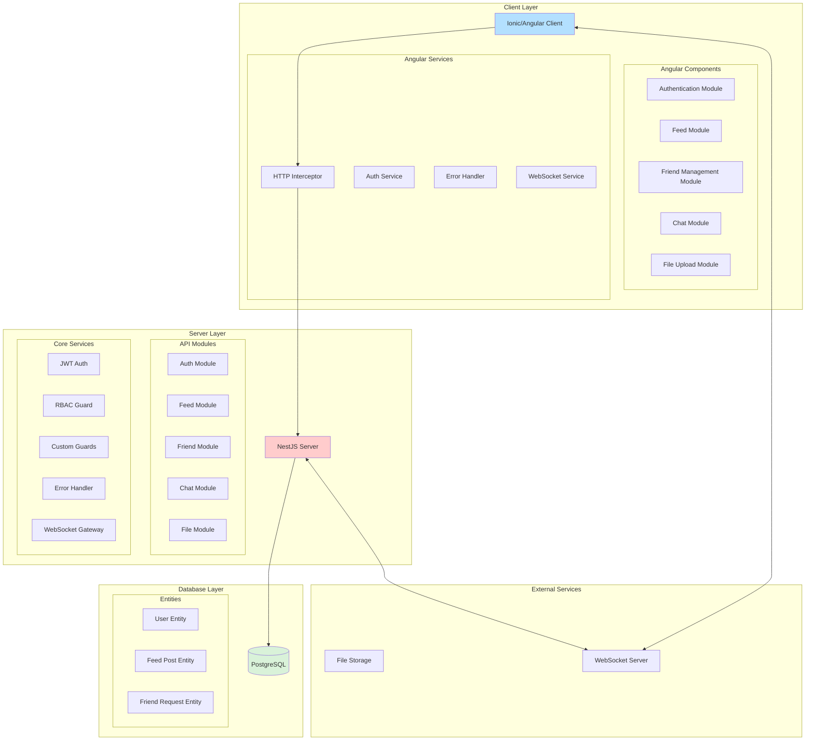

# System Architecture Documentation

## High-Level Architecture Diagram

## Architecture Overview

### 1. Client Layer (Ionic/Angular)

- **Framework**: Ionic Angular for cross-platform mobile support
- **Key Features**:
  - Mobile-responsive UI
  - Authentication (Login/Signup)
  - Infinite scroll pagination
  - Real-time chat
  - Image upload with validation
  - Friend request management

#### Core Components:

- Authentication Module
- Feed Module
- Friend Management Module
- Chat Module
- File Upload Module

#### Services:

- HTTP Interceptor for authenticated requests
- Error handling service
- WebSocket service for real-time features
- Authentication service with RBAC

### 2. Server Layer (NestJS)

- **Framework**: NestJS with TypeScript
- **Key Features**:
  - REST API endpoints
  - JWT Authentication
  - Role-Based Access Control (RBAC)
  - File upload handling with Multer
  - WebSocket integration
  - Custom Guards
  - Error handling and validation

#### Core Modules:

- Authentication Module (JWT + Password Hashing)
- Feed Module (CRUD + Pagination)
- Friend Request Module
- Chat Module (WebSocket)
- File Upload Module

#### Security Features:

- JWT Authentication
- Password Hashing
- Custom Guards
- Role-Based Authorization
- File Type Validation

### 3. Database Layer (PostgreSQL)

- **ORM**: TypeORM
- **Key Entities**:
  - User Entity
  - Feed Post Entity
  - Friend Request Entity

#### Key Relationships:

- One-to-Many: User → Feed Posts
- Many-to-Many: User ↔ User (via Friend Requests)

### 4. External Services

- WebSocket Server for real-time chat
- File Storage for user uploads

## Testing Strategy

### Backend Testing (NestJS)

- Unit Testing for Controllers and Services
- E2E Testing with SuperTest
- Custom Guard Testing
- WebSocket Testing

### Frontend Testing (Angular)

- Unit Testing with Karma/Jasmine
- E2E Testing with Cypress
- Component Testing
- Service Testing

## Security Measures

1. **Authentication**:

   - JWT-based authentication
   - Password hashing
   - Secure token storage

2. **Authorization**:

   - Role-based access control
   - Custom guards for specific routes
   - HTTP interceptors for secure requests

3. **Data Security**:
   - File type validation
   - MIME type checking
   - Password exclusion from queries
   - Input validation

## Error Handling

1. **Frontend**:

   - Global error handling
   - HTTP error interceptors
   - User-friendly error messages

2. **Backend**:
   - Global exception filters
   - Validation pipes
   - Custom error responses
   - Logging system

## Scalability Considerations

1. **Database**:

   - Pagination implementation
   - Efficient query optimization
   - Proper indexing

2. **API**:

   - RESTful best practices
   - Modular architecture
   - Caching strategies

3. **Real-time Features**:
   - WebSocket implementation
   - Connection pooling
   - Event-driven architecture

## Development Best Practices

1. **Code Organization**:

   - Modular architecture
   - Separation of concerns
   - TypeScript typing
   - Interface definitions

2. **Testing**:

   - Comprehensive test coverage
   - Automated testing pipeline
   - Integration tests
   - E2E tests

3. **Documentation**:
   - API documentation
   - Code comments
   - Architecture documentation
   - Setup guides

## Deployment Considerations

- Environment configuration
- Database migrations
- Asset management
- Build optimization
- Mobile deployment (Capacitor)
