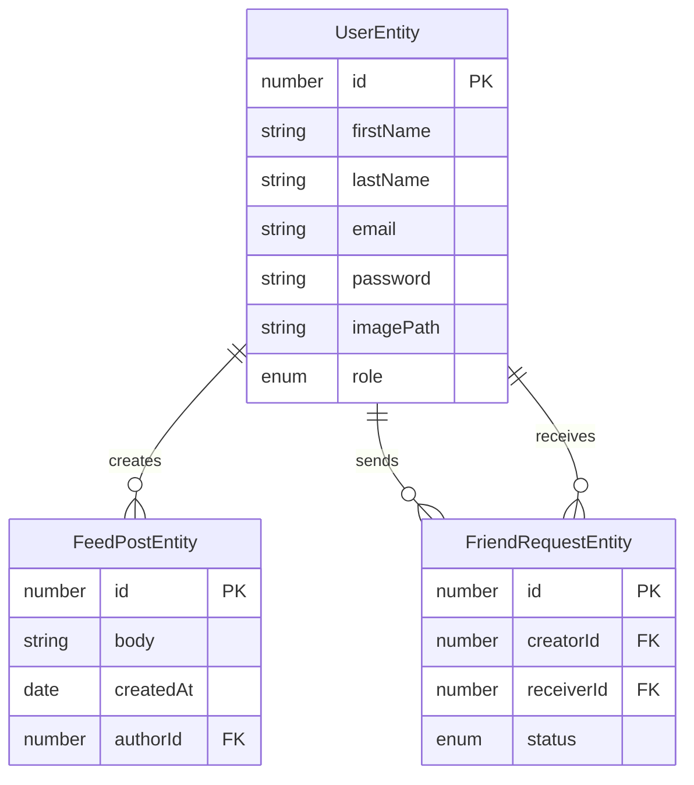

# Entity Relationship Diagram Documentation

## Database Schema Diagram

## Overview
This document describes the entity relationships in the LinkedIn clone application's database schema.

## Entities

### UserEntity
The central entity representing a user in the system.

**Primary Key:**
- `id` (number) - Auto-generated primary key

**Attributes:**
- `firstName` (string) - User's first name
- `lastName` (string) - User's last name
- `email` (string) - Unique email address
- `password` (string) - Hashed password (excluded from select)
- `imagePath` (string, nullable) - Path to user's profile image
- `role` (enum: Role) - User role, defaults to 'USER'

**Relationships:**
- One-to-Many with `FeedPostEntity` (as author)
- One-to-Many with `FriendRequestEntity` (as creator)
- One-to-Many with `FriendRequestEntity` (as receiver)

### FeedPostEntity
Represents a post in the user's feed.

**Primary Key:**
- `id` (number) - Auto-generated primary key

**Attributes:**
- `body` (string) - Post content, defaults to empty string
- `createdAt` (Date) - Timestamp of post creation

**Relationships:**
- Many-to-One with `UserEntity` (author)

### FriendRequestEntity
Manages friend requests between users.

**Primary Key:**
- `id` (number) - Auto-generated primary key

**Attributes:**
- `status` (enum: FriendRequest_Status) - Current status of the friend request

**Relationships:**
- Many-to-One with `UserEntity` (creator)
- Many-to-One with `UserEntity` (receiver)

## Relationship Details

### User-FeedPost Relationship
- A user can create multiple feed posts
- Each feed post belongs to exactly one user (author)
- Relationship is managed through the `author` field in `FeedPostEntity`

### User-FriendRequest Relationship
- A user can send multiple friend requests (as creator)
- A user can receive multiple friend requests (as receiver)
- Bi-directional relationship allowing tracking of both sent and received requests
- Relationships managed through `creator` and `receiver` fields in `FriendRequestEntity`

## Database Constraints
- User email must be unique
- User password is excluded from default selects for security
- Feed post body defaults to empty string
- User role defaults to 'USER'
- User image path is optional (nullable)

## Notes
- The schema supports basic social networking features including:
  - User management with role-based access
  - Feed post creation and attribution
  - Friend request system with status tracking
- Timestamps are automatically managed for feed posts
- Password field is protected from accidental exposure through select exclusion
