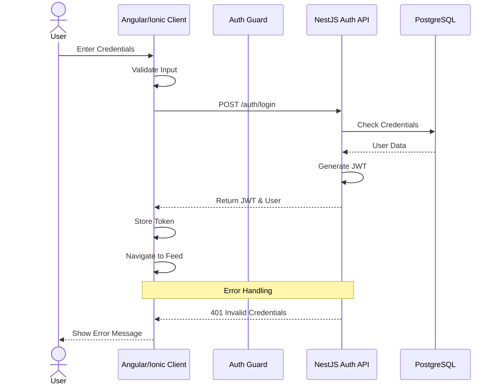
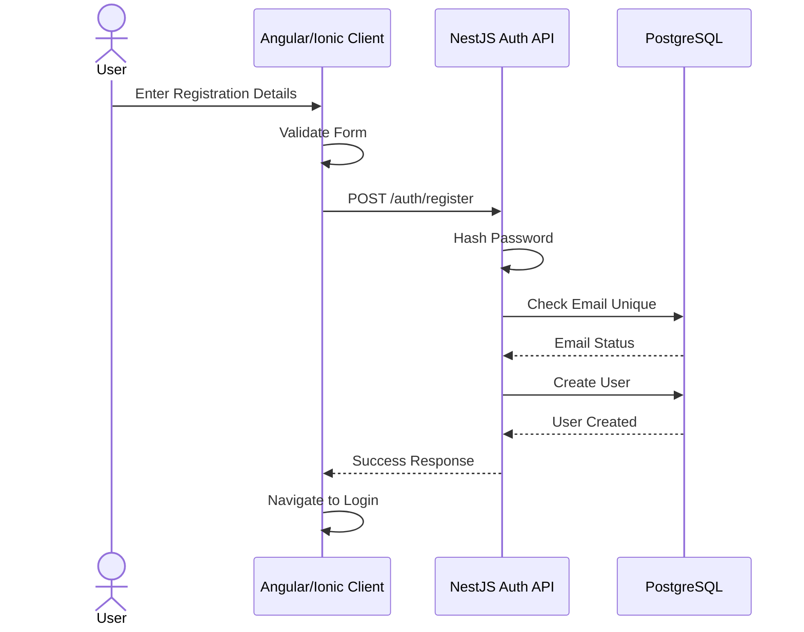
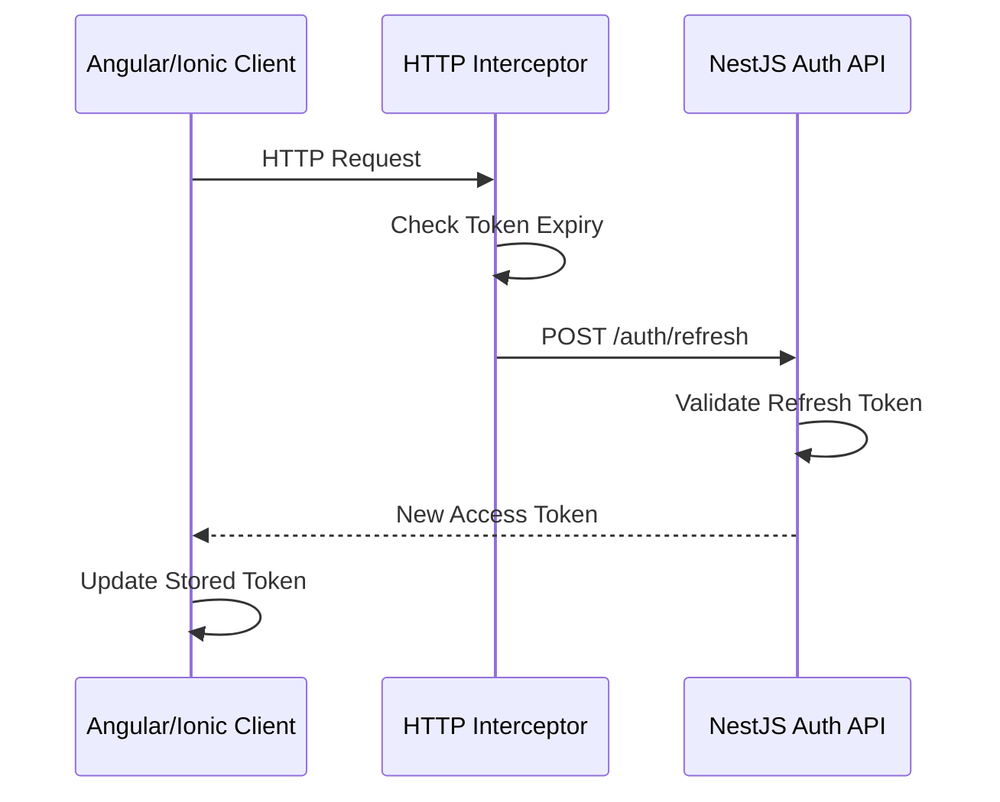
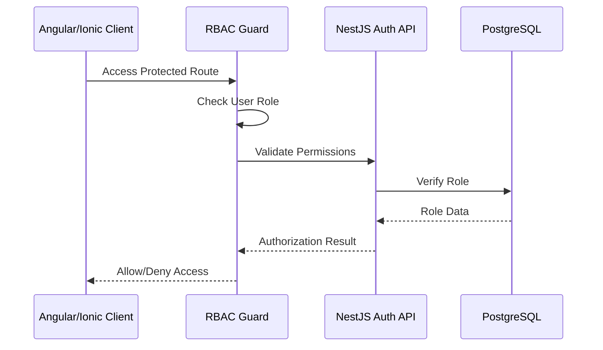

# Authentication Flow Documentation

## Login Flow

```mermaid
sequenceDiagram
    actor User
    participant Client as Angular/Ionic Client
    participant Guard as Auth Guard
    participant API as NestJS Auth API
    participant DB as PostgreSQL

    User->>Client: Enter Credentials
    Client->>Client: Validate Input
    Client->>API: POST /auth/login
    API->>DB: Check Credentials
    DB-->>API: User Data
    API->>API: Generate JWT
    API-->>Client: Return JWT & User
    Client->>Client: Store Token
    Client->>Client: Navigate to Feed

    Note over Client,API: Error Handling
    API-->>Client: 401 Invalid Credentials
    Client-->>User: Show Error Message
```

## Registration Flow

```mermaid
sequenceDiagram
    actor User
    participant Client as Angular/Ionic Client
    participant API as NestJS Auth API
    participant DB as PostgreSQL

    User->>Client: Enter Registration Details
    Client->>Client: Validate Form
    Client->>API: POST /auth/register
    API->>API: Hash Password
    API->>DB: Check Email Unique
    DB-->>API: Email Status
    API->>DB: Create User
    DB-->>API: User Created
    API-->>Client: Success Response
    Client->>Client: Navigate to Login
```

## Token Refresh Flow

```mermaid
sequenceDiagram
    participant Client as Angular/Ionic Client
    participant Interceptor as HTTP Interceptor
    participant API as NestJS Auth API

    Client->>Interceptor: HTTP Request
    Interceptor->>Interceptor: Check Token Expiry
    Interceptor->>API: POST /auth/refresh
    API->>API: Validate Refresh Token
    API-->>Client: New Access Token
    Client->>Client: Update Stored Token
```

## Role-Based Authorization

```mermaid
sequenceDiagram
    participant Client as Angular/Ionic Client
    participant Guard as RBAC Guard
    participant API as NestJS Auth API
    participant DB as PostgreSQL

    Client->>Guard: Access Protected Route
    Guard->>Guard: Check User Role
    Guard->>API: Validate Permissions
    API->>DB: Verify Role
    DB-->>API: Role Data
    API-->>Guard: Authorization Result
    Guard-->>Client: Allow/Deny Access
```
