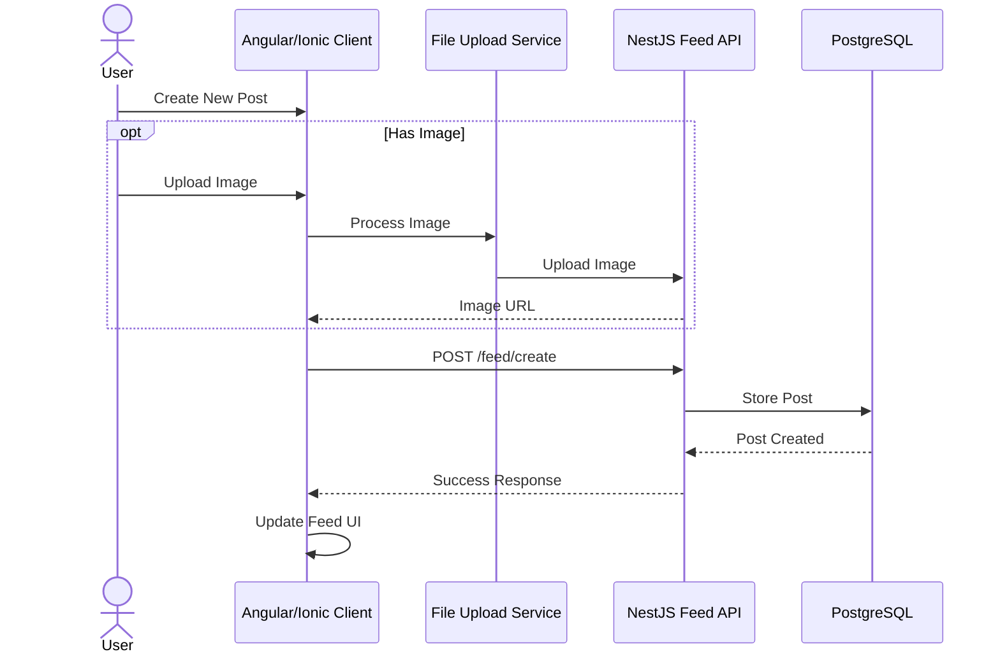
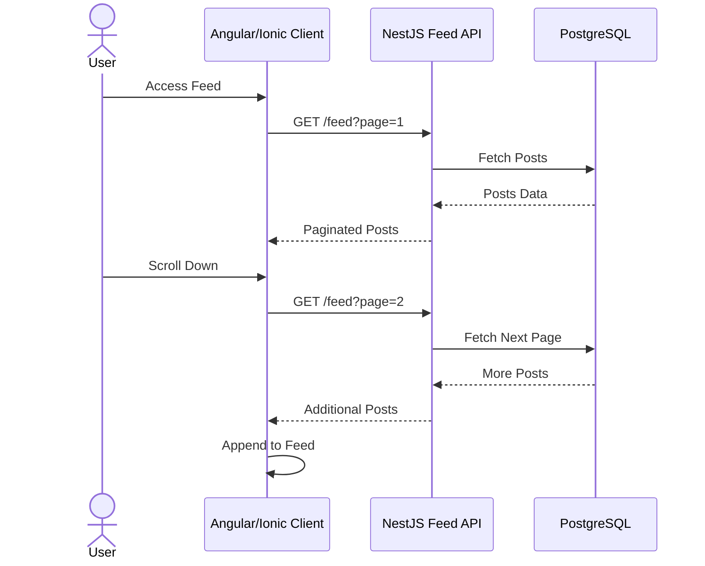
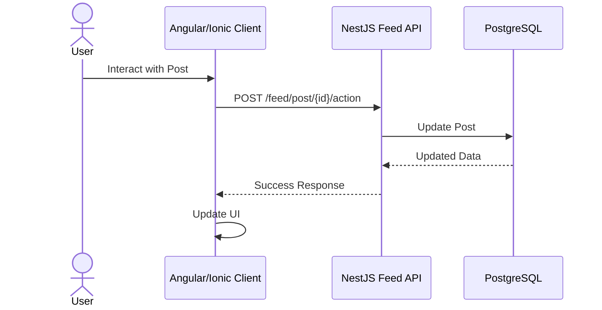

# Feed Management Flow Documentation

## Post Creation Flow

```mermaid
sequenceDiagram
    actor User
    participant Client as Angular/Ionic Client
    participant Upload as File Upload Service
    participant API as NestJS Feed API
    participant DB as PostgreSQL

    User->>Client: Create New Post
    opt Has Image
        User->>Client: Upload Image
        Client->>Upload: Process Image
        Upload->>API: Upload Image
        API-->>Client: Image URL
    end
    Client->>API: POST /feed/create
    API->>DB: Store Post
    DB-->>API: Post Created
    API-->>Client: Success Response
    Client->>Client: Update Feed UI
```

## Feed Retrieval with Pagination

```mermaid
sequenceDiagram
    actor User
    participant Client as Angular/Ionic Client
    participant API as NestJS Feed API
    participant DB as PostgreSQL

    User->>Client: Access Feed
    Client->>API: GET /feed?page=1
    API->>DB: Fetch Posts
    DB-->>API: Posts Data
    API-->>Client: Paginated Posts

    User->>Client: Scroll Down
    Client->>API: GET /feed?page=2
    API->>DB: Fetch Next Page
    DB-->>API: More Posts
    API-->>Client: Additional Posts
    Client->>Client: Append to Feed
```

## Post Interaction Flow

```mermaid
sequenceDiagram
    actor User
    participant Client as Angular/Ionic Client
    participant API as NestJS Feed API
    participant DB as PostgreSQL

    User->>Client: Interact with Post
    Client->>API: POST /feed/post/{id}/action
    API->>DB: Update Post
    DB-->>API: Updated Data
    API-->>Client: Success Response
    Client->>Client: Update UI
```
