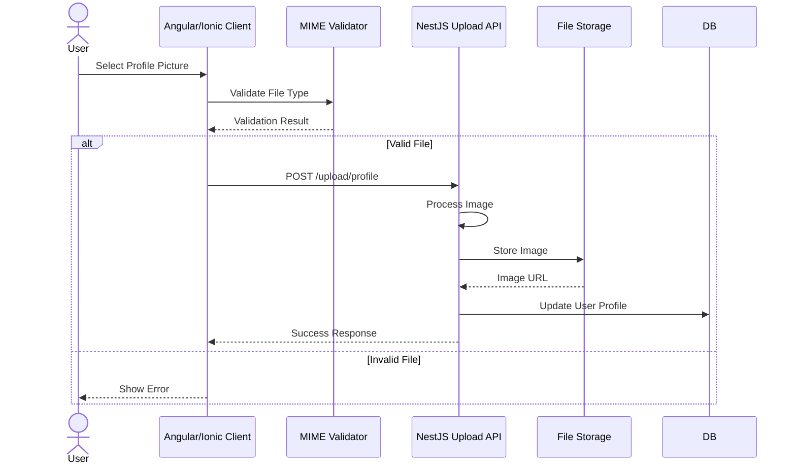
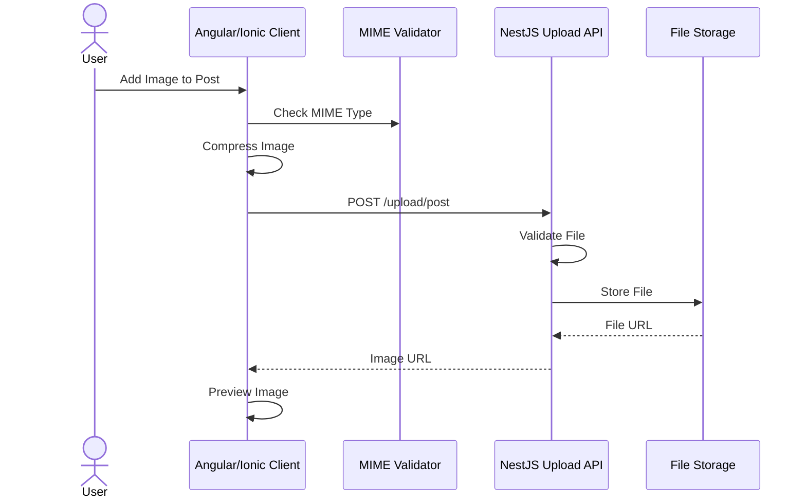
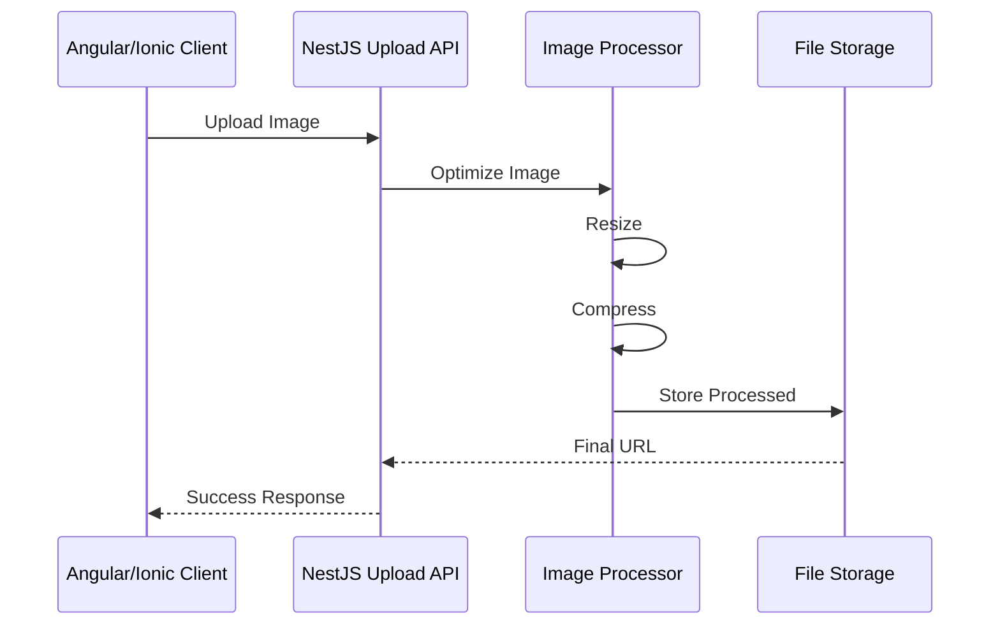

# Media Upload Flow Documentation

## Profile Picture Upload

```mermaid
sequenceDiagram
    actor User
    participant Client as Angular/Ionic Client
    participant Validator as MIME Validator
    participant API as NestJS Upload API
    participant Storage as File Storage

    User->>Client: Select Profile Picture
    Client->>Validator: Validate File Type
    Validator-->>Client: Validation Result

    alt Valid File
        Client->>API: POST /upload/profile
        API->>API: Process Image
        API->>Storage: Store Image
        Storage-->>API: Image URL
        API->>DB: Update User Profile
        API-->>Client: Success Response
    else Invalid File
        Client-->>User: Show Error
    end
```

## Post Image Upload

```mermaid
sequenceDiagram
    actor User
    participant Client as Angular/Ionic Client
    participant Validator as MIME Validator
    participant API as NestJS Upload API
    participant Storage as File Storage

    User->>Client: Add Image to Post
    Client->>Validator: Check MIME Type
    Client->>Client: Compress Image
    Client->>API: POST /upload/post
    API->>API: Validate File
    API->>Storage: Store File
    Storage-->>API: File URL
    API-->>Client: Image URL
    Client->>Client: Preview Image
```

## Image Processing Flow

```mermaid
sequenceDiagram
    participant Client as Angular/Ionic Client
    participant API as NestJS Upload API
    participant Process as Image Processor
    participant Storage as File Storage

    Client->>API: Upload Image
    API->>Process: Optimize Image
    Process->>Process: Resize
    Process->>Process: Compress
    Process->>Storage: Store Processed
    Storage-->>API: Final URL
    API-->>Client: Success Response
```
